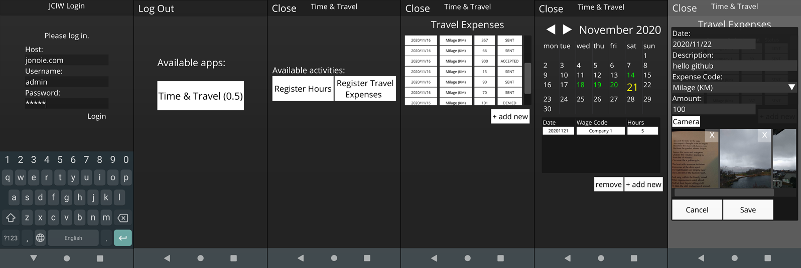
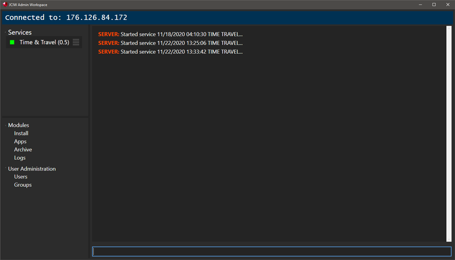

# JCIW

  

Cross platform C# app solution using Dear ImGui, NetworkComms.Net, Xamarin and MonoGame.

Includes: 
JCIW Desktop Client (Mono Compatible) 
JCIW Android Client 
Server (Mono Compatible) 
Admin Client (Server user, group and module administation tool - Windows Only) 

JCIW API: 
Build UI using ImGui 
Define and send / receive packets using a custom packet solution (Powered by NetworkComms.net) 
Read / write data using a custom database solution 
Option to create MonoGame drawable class to access the underlying MonoGame instance. 

Create a JCIW app or service in C#, upload it to the JCIW server and deploy it to mobile and desktops.

## Features

## Compiling
### Prerequisites
* Microsoft Visual Studio 2012+
* MonoGame 3.7
* SQLite

**To compile**: 

1. Open JCIW.sln in Visual Studio

2. Build Solution

## Media

|    **Desktop client opening demo app** |    **Android client opening demo app** |    **Admin client** |    **Visual Studio templates** | 
|----|----|----|----|

