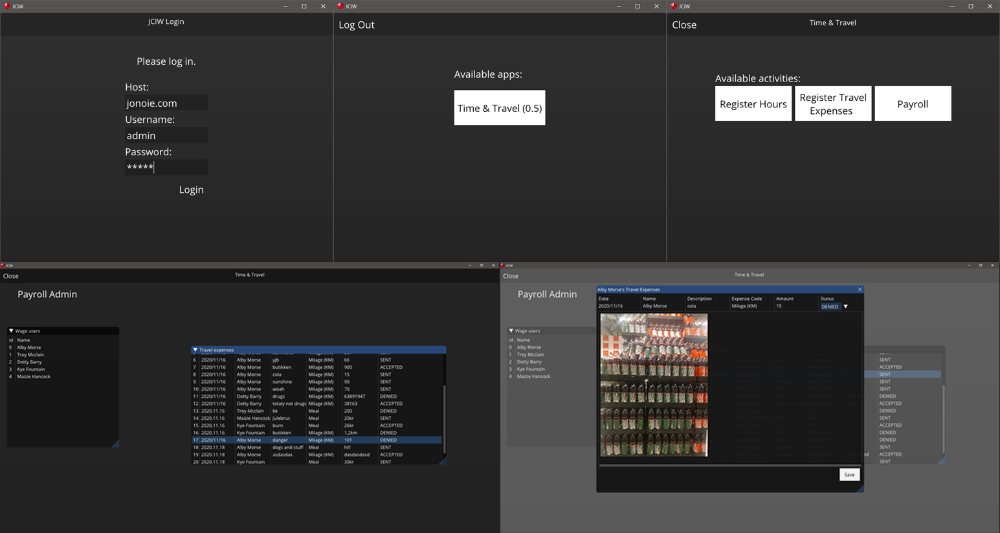

# JCIW

  

Cross platform C# app development and distribution solution using Dear ImGui, NetworkComms.Net, Xamarin and MonoGame.

With JCIW you can easily program graphical applications using the built-in tools and templates, compile it, upload the compiled file to the JCIW Server and then distribute to all your users. The applications are then run by opening up the JCIW Client, logging in to your account and opening it from the application list. Desktop and Android is currently supported. Visit the GitHub page  [here](https://github.com/j0nat/JCIW).

&nbsp;

Two types of "modules" can be made using the JCIW Framework:
| |  |
|--|--|
| **App Module** | Graphical application for JCIW Client. Has access to platform functions such as the Android camera for taking pictures. |
| **Service Module** | Server application for JCIW Server. Has access to server functions (such as authorized users) and database. |

With these you can send and receive custom packets from and to the app and service module.

&nbsp;

The solution has four parts:
| |  |
|--|--|
| **The JCIW Server** | Runs service modules, administrates user and groups and deploys applications. |
| **The JCIW Admin Client** | For administrating the server. |
| **The JCIW Client** | Used to run JCIW apps. |
| **The JCIW Development tools** | JCIW Libraries and Visual Studio templates used to create JCIW Modules. |

## Features
Server-Client plug-in system. 
Development framework for modules. 
Built-in networking 
Built-in database. 
Built-in login / user / groups or permission systems. 
Clients for Desktop and mobile. 
Powerful GUI tools (Dear ImGui) 
 
Build your apps in the JCIW Framework, upload it to your JCIW Server and run them using the JCIW Client.

## Compiling
### Prerequisites
* Microsoft Visual Studio 2012+
* MonoGame 3.7
* SQLite

**To compile**: 

1. Open JCIW.sln in Visual Studio

2. Build Solution

## Media

|    **Desktop client opening demo app** |    **Android client opening demo app** |    **Admin client** |    **Visual Studio templates** | 
|----|----|----|----|

