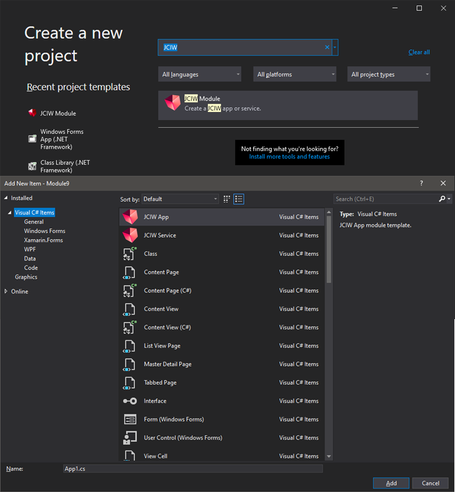

# JCIW

  

Cross platform C# app development and distribution solution using Dear ImGui, NetworkComms.Net, Xamarin and MonoGame.

Includes: 
JCIW Desktop Client (Mono Compatible) 
JCIW Android Client 
Server (Mono Compatible) 
Admin Client (Server user, group and module administation tool - Windows Only) 

## Features
Server-Client plug-in system. 
Development framework for modules. 
Built-in networking 
Built-in database. 
Built-in login / user / groups or permission systems. 
Clients for Desktop and mobile. 
Powerful GUI tools (Dear ImGui) 
 
Build your apps in the JCIW Framework, upload it to your JCIW Server and run them using the JCIW Client.

## Compiling
### Prerequisites
* Microsoft Visual Studio 2012+
* MonoGame 3.7
* SQLite

**To compile**: 

1. Open JCIW.sln in Visual Studio

2. Build Solution

## Media

|    **Desktop client opening demo app** |    **Android client opening demo app** |    **Admin client** |    **Visual Studio templates** | 
|----|----|----|----|

